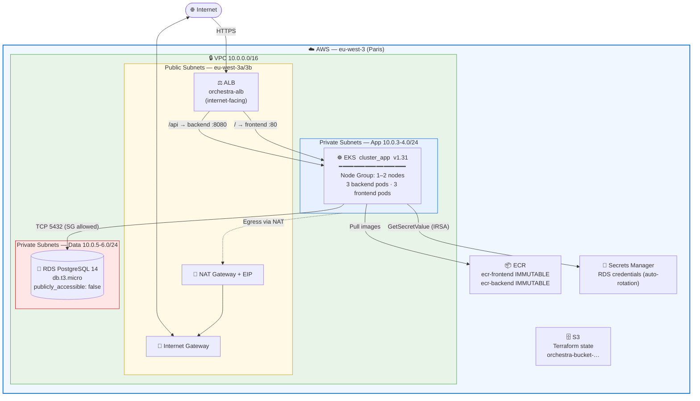
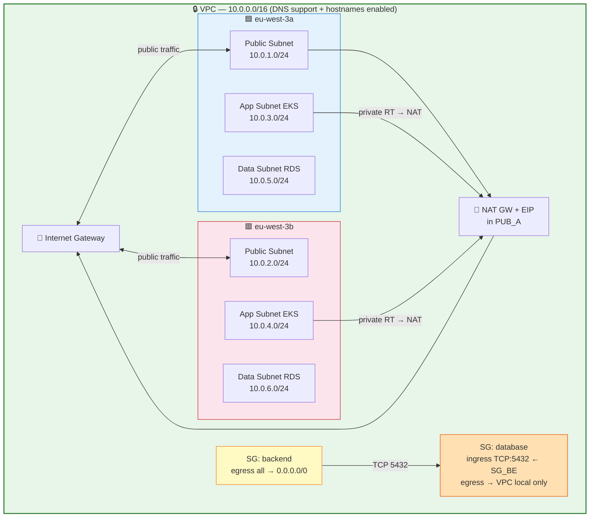
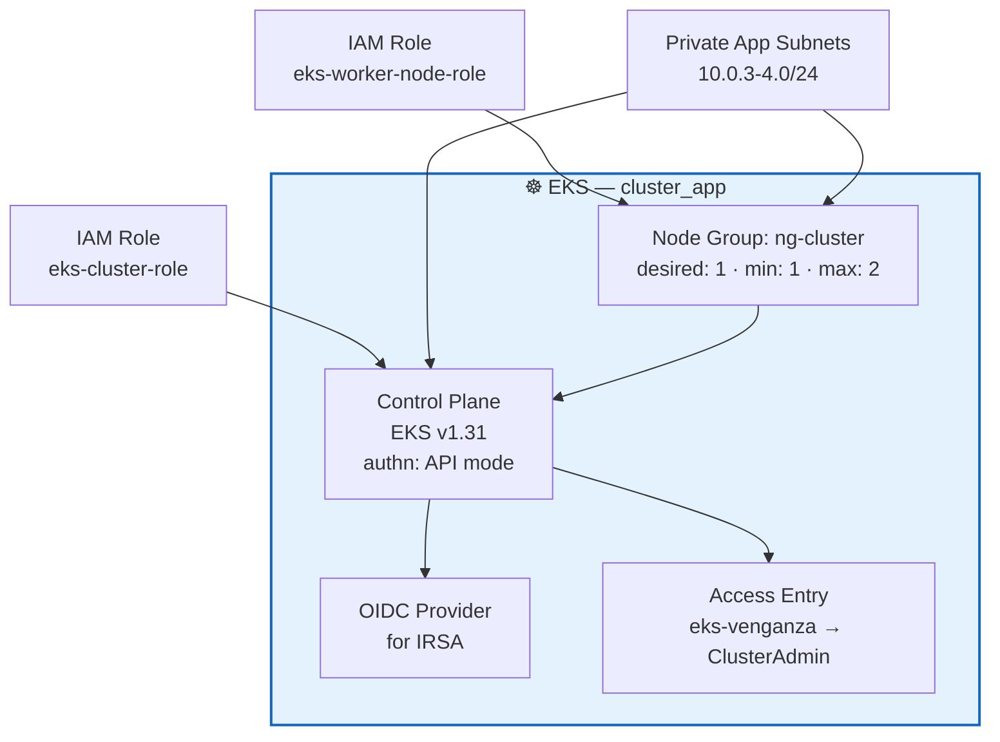
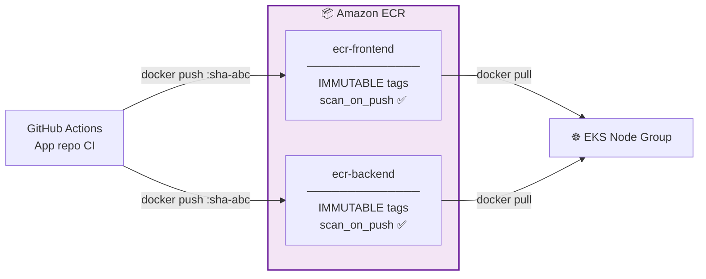
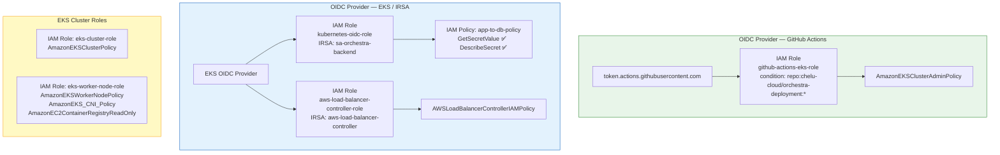
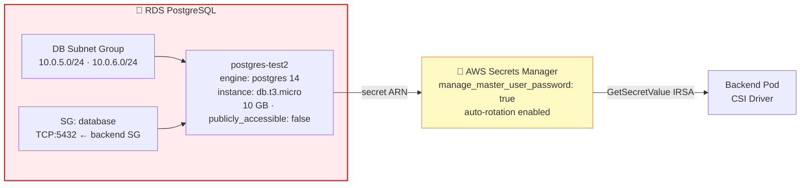
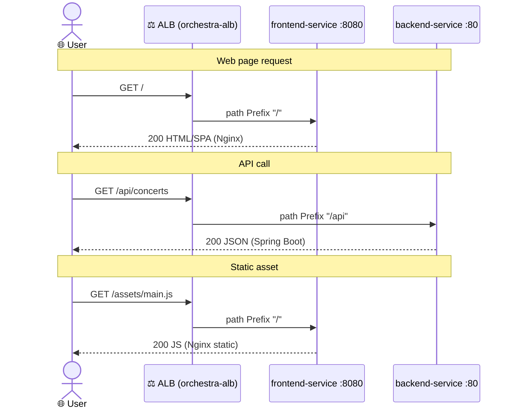
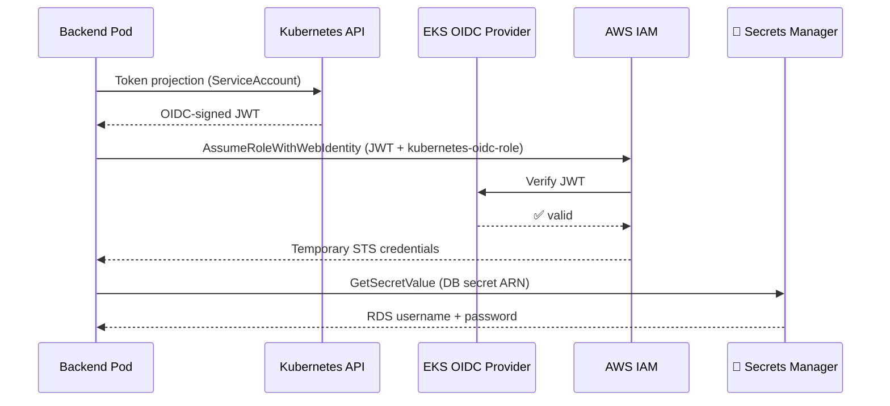
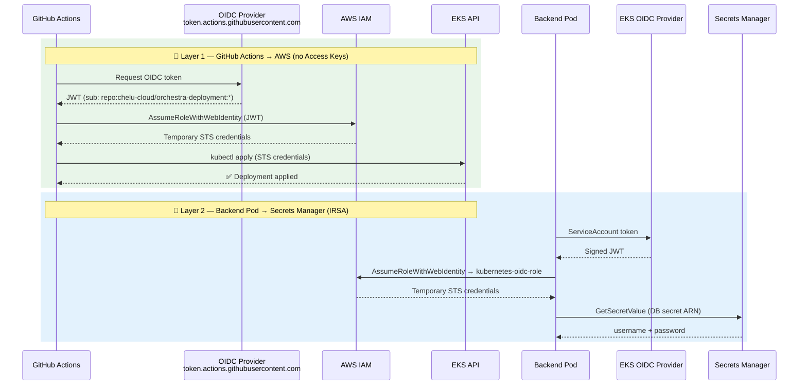
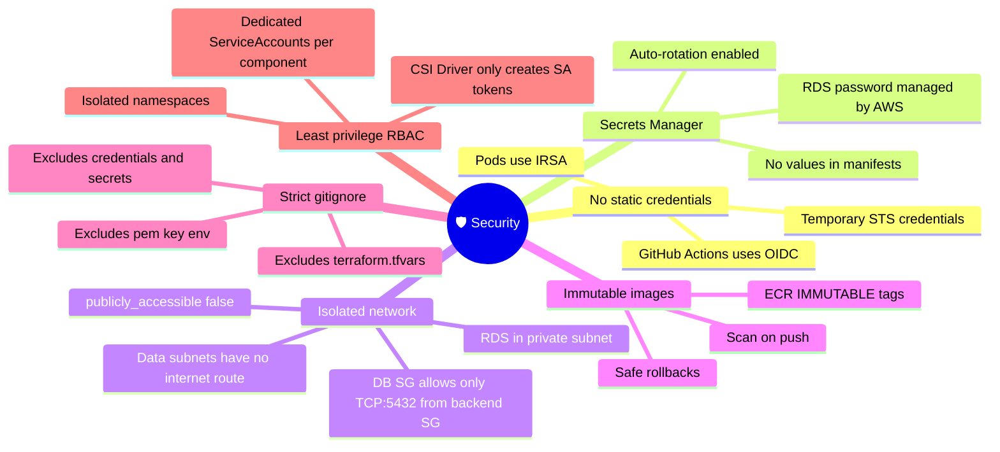

<div align="center">

# 🎼 Orchestra Deployment

**GitOps** infrastructure and deployment repository for the Orchestra platform.
Provisions AWS with Terraform and deploys the application on Kubernetes via GitHub Actions.


</div>

---

## 📋 Table of Contents

- [General Architecture](#-general-architecture)
- [Prerequisites](#-prerequisites)
- [Repository Structure](#-repository-structure)
- [Infrastructure — Terraform](#-infrastructure--terraform)
  - [Module Dependencies](#module-dependencies)
  - [Module: network](#module-network)
  - [Module: eks](#module-eks)
  - [Module: ecr](#module-ecr)
  - [Module: iam](#module-iam)
  - [Module: storage](#module-storage)
- [Kubernetes](#-kubernetes)
  - [Cluster Overview](#cluster-overview)
  - [Deployments & Resources](#deployments--resources)
  - [ALB Routing](#alb-routing)
  - [RBAC & Service Accounts](#rbac--service-accounts)
- [CI/CD — GitHub Actions](#-cicd--github-actions)
  - [Full GitOps Flow](#full-gitops-flow)
  - [OIDC Authentication](#oidc-authentication)
- [Required Secrets](#-required-secrets)
- [Step-by-Step Deployment](#-step-by-step-deployment)
- [Security](#-security)

---

## 🏗 General Architecture

High-level view of all AWS components and how they relate to each other.



| Layer | Technology |
|-------|------------|
| Infrastructure as Code | Terraform ≥ 1.0 · AWS provider `~> 5.0` |
| Container Orchestration | Amazon EKS v1.31 |
| Image Registry | Amazon ECR — 2 repositories (frontend + backend) |
| Database | Amazon RDS PostgreSQL 14 (`db.t3.micro`) |
| Networking | VPC · IGW · NAT GW · Route Tables · Security Groups |
| Identity | IAM Roles · OIDC (IRSA + GitHub Actions) |
| Ingress | AWS Load Balancer Controller (ALB) |
| Secret Management | AWS Secrets Manager + Secrets Store CSI Driver |
| CI/CD | GitHub Actions (GitOps) |

---

## ✅ Prerequisites

- [Terraform](https://developer.hashicorp.com/terraform/install) ≥ 1.0
- [AWS CLI](https://docs.aws.amazon.com/cli/latest/userguide/install-cliv2.html) v2 configured with admin credentials
- [kubectl](https://kubernetes.io/docs/tasks/tools/) and [Kustomize](https://kustomize.io/)
- [Helm](https://helm.sh/) (to install ALB Controller and CSI Driver)
- S3 bucket `orchestra-bucket-622370466117-eu-west-3-an` created beforehand (Terraform backend)
- IAM permissions to create VPC, EKS, ECR, RDS, and IAM roles

---

## 📁 Repository Structure

```
orchestra-deployment/
├── .github/
│   └── workflows/
│       └── deploy.yaml              # GitOps pipeline → EKS
├── despliegue/
│   ├── k8s/                         # Kubernetes manifests
│   │   ├── namespace.yaml           # orchestra-namespace
│   │   ├── backend-deployment.yaml  # 3 replicas, port 8080
│   │   ├── backend-service.yaml
│   │   ├── frontend-deployment.yaml # 3 replicas, port 80 (Nginx)
│   │   ├── frontend-service.yaml
│   │   ├── ingress.yaml             # internet-facing ALB
│   │   ├── rbac.yaml                # Role + RoleBinding CSI Driver
│   │   ├── serviceAccount.yaml      # IRSA backend + frontend
│   │   └── kustomization.yaml       # Dynamic image tag management
│   └── terraform/
│       ├── main.tf                  # Module composition
│       ├── backend.tf               # Remote state in S3
│       ├── providers.tf             # AWS provider eu-west-3
│       └── modules/
│           ├── network/             # VPC · Subnets · IGW · NAT · SGs
│           ├── eks/                 # Cluster · Node Group · OIDC
│           ├── ecr/                 # Docker image repositories
│           ├── iam/                 # Roles · Policies · OIDC providers
│           └── storage/             # RDS PostgreSQL + Subnet Group
└── .gitignore                       # Excludes secrets, tfstate, .env…
```

---

## 🔧 Infrastructure — Terraform

State is stored remotely in S3:

```hcl
# despliegue/terraform/backend.tf
bucket = "orchestra-bucket-622370466117-eu-west-3-an"
key    = "proyect/proyect.tfstate"
region = "eu-west-3"
```

### Module Dependencies

`main.tf` acts as the root that orchestrates all five modules, passing outputs between them:


---

### Module: network

**Path:** `despliegue/terraform/modules/network/`



| Resource | CIDR / Value |
|----------|-------------|
| VPC | `10.0.0.0/16` |
| Public subnets | `10.0.1.0/24`, `10.0.2.0/24` |
| App subnets (EKS) | `10.0.3.0/24`, `10.0.4.0/24` |
| Data subnets (RDS) | `10.0.5.0/24`, `10.0.6.0/24` |
| AZs | `eu-west-3a`, `eu-west-3b` |
| SG Backend | Full egress to `0.0.0.0/0` |
| SG Database | Ingress only TCP:5432 from SG Backend |

---

### Module: eks

**Path:** `despliegue/terraform/modules/eks/`



| Parameter | Value |
|-----------|-------|
| Name | `cluster_app` |
| Version | `1.31` |
| Authentication | `API` mode |
| Node Group | `ng-cluster` — desired 1, min 1, max 2 |
| Subnets | Private app subnets (multi-AZ) |
| IAM Admin | `eks-venganza` with `AmazonEKSClusterAdminPolicy` |

---

### Module: ecr

**Path:** `despliegue/terraform/modules/ecr/`



> **Immutable tags:** once an image is published with a specific tag it cannot be overwritten, ensuring full traceability and safe rollbacks.

---

### Module: iam

**Path:** `despliegue/terraform/modules/iam/`



---

### Module: storage

**Path:** `despliegue/terraform/modules/storage/`



| Parameter | Value |
|-----------|-------|
| Identifier | `postgres-test2` |
| Engine | PostgreSQL 14 |
| Instance | `db.t3.micro` |
| Storage | 10 GB |
| Public access | `false` |
| Password | Managed by AWS Secrets Manager (auto-rotation) |

---

## ☸️ Kubernetes

All manifests belong to the `orchestra-namespace` namespace.

### Cluster Overview


---

### Deployments & Resources

| Parameter | Backend | Frontend |
|-----------|---------|----------|
| Replicas | 3 | 3 |
| Base image | `ecr-backend` | `ecr-frontend` (Nginx) |
| Container port | `8080` | `80` |
| CPU request / limit | `250m` / `1` | `250m` / `1` |
| Memory request / limit | `512Mi` / `1Gi` | `512Mi` / `1Gi` |
| Service Account | `sa-orchestra-backend` | `sa-orchestra-frontend` |
| DB Secrets | CSI Driver → `/mnt/secrets-store` | — |

---

### ALB Routing



---

### RBAC & Service Accounts

The backend uses **IRSA (IAM Roles for Service Accounts)** to access Secrets Manager without static credentials:



**RBAC for the CSI Driver:**


---

## 🔄 CI/CD — GitHub Actions

**Workflow:** `.github/workflows/deploy.yaml`

| Trigger | Condition |
|---------|-----------|
| `push` to `main` | Only when changes are made under `k8s/**` |
| `workflow_dispatch` | Manual run from GitHub UI |
| `repository_dispatch` | `deploy-trigger` event sent from the app repo |

### Full GitOps Flow


---

### OIDC Authentication

The project uses OIDC in **two independent layers** to completely eliminate the use of long-lived AWS credentials:



---

## 🔑 Required Secrets

Configure in **GitHub → Settings → Secrets and variables → Actions:**

| Secret | Description | How to get it |
|--------|-------------|---------------|
| `AWS_DB_SECRET_ARN` | ARN of the RDS secret in Secrets Manager | `db_secret_arn_final` output from `terraform apply` |

> ℹ️ `AWS_ACCESS_KEY_ID` and `AWS_SECRET_ACCESS_KEY` are **not needed**. AWS authentication is handled via OIDC.

---

## 🚀 Step-by-Step Deployment

### 1 — Provision infrastructure with Terraform

```bash
cd despliegue/terraform

# Initialize — downloads providers and configures the S3 backend
terraform init

# Review the plan before applying
terraform plan

# Provision
terraform apply
```

> Note the `db_secret_arn_final` output and set it as the `AWS_DB_SECRET_ARN` secret in GitHub.

### 2 — Connect kubectl to the cluster

```bash
aws eks update-kubeconfig --name cluster_app --region eu-west-3
kubectl get nodes   # verify nodes are in Ready state
```

### 3 — Install cluster components (Helm)

```bash
# AWS Load Balancer Controller
helm repo add eks https://aws.github.io/eks-charts
helm repo update
helm install aws-load-balancer-controller eks/aws-load-balancer-controller \
  -n kube-system \
  --set clusterName=cluster_app \
  --set serviceAccount.create=false \
  --set serviceAccount.name=aws-load-balancer-controller

# Secrets Store CSI Driver
helm repo add secrets-store-csi-driver \
  https://kubernetes-sigs.github.io/secrets-store-csi-driver/charts
helm install csi-secrets-store \
  secrets-store-csi-driver/secrets-store-csi-driver \
  -n kube-system \
  --set syncSecret.enabled=true
```

### 4 — Deploy Kubernetes manifests

Deployment runs **automatically via GitHub Actions**. For a manual deployment:

```bash
cd despliegue/k8s
kubectl apply -k .
```

### 5 — Verify the deployment

```bash
# Check running pods
kubectl get pods -n orchestra-namespace

# Check services and ingress
kubectl get svc,ingress -n orchestra-namespace

# Get the public ALB URL
kubectl get ingress orchestra-ingress -n orchestra-namespace \
  -o jsonpath='{.status.loadBalancer.ingress[0].hostname}'

# Tail backend logs
kubectl logs -l app=backend-deployment -n orchestra-namespace --tail=50
```

---

## 🛡 Security



| Measure | Detail |
|---------|---------|
| 🔑 No static credentials | GitHub Actions and EKS pods authenticate via OIDC/IRSA |
| 🔐 Secrets Manager | RDS credentials rotated by AWS; never stored in plain text |
| 🌐 Isolated network | RDS in private subnets; DB SG only accepts TCP:5432 from backend SG |
| 📦 Immutable images | ECR with `IMMUTABLE` tags and automatic vulnerability scanning |
| 🚫 Strict `.gitignore` | Excluded: `*.pem`, `*.key`, `*credentials*`, `terraform.tfvars`, `.env` |
| 🔒 Least privilege RBAC | CSI Driver only has permission to create ServiceAccount tokens |

---

<div align="center">

**Orchestra Deployment** · Infrastructure managed with Terraform · Deployments with GitOps

Developed with ❤️ by chelucloud / cheludev (my other github) · [LinkedIn](https://www.linkedin.com/in/jose-luis-salvador-martin-b88ba3292/)

</div>