<div align="center">

# 🎼 Orchestra Deployment

Repositorio de infraestructura y despliegue **GitOps** para la plataforma Orchestra.
Aprovisiona AWS con Terraform y despliega la aplicación en Kubernetes mediante GitHub Actions.


</div>

---

## 📋 Índice

- [Arquitectura general](#-arquitectura-general)
- [Requisitos previos](#-requisitos-previos)
- [Estructura del repositorio](#-estructura-del-repositorio)
- [Infraestructura — Terraform](#-infraestructura--terraform)
  - [Dependencias entre módulos](#dependencias-entre-módulos)
  - [Módulo: network](#módulo-network)
  - [Módulo: eks](#módulo-eks)
  - [Módulo: ecr](#módulo-ecr)
  - [Módulo: iam](#módulo-iam)
  - [Módulo: storage](#módulo-storage)
- [Kubernetes](#-kubernetes)
  - [Vista general del clúster](#vista-general-del-clúster)
  - [Despliegues y recursos](#despliegues-y-recursos)
  - [Enrutamiento con ALB](#enrutamiento-con-alb)
  - [RBAC y Service Accounts](#rbac-y-service-accounts)
- [CI/CD — GitHub Actions](#-cicd--github-actions)
  - [Flujo GitOps completo](#flujo-gitops-completo)
  - [Autenticación OIDC](#autenticación-oidc)
- [Secretos requeridos](#-secretos-requeridos)
- [Despliegue paso a paso](#-despliegue-paso-a-paso)
- [Seguridad](#-seguridad)

---

## 🏗 Arquitectura general

Vista de alto nivel de todos los componentes AWS y cómo se relacionan entre sí.

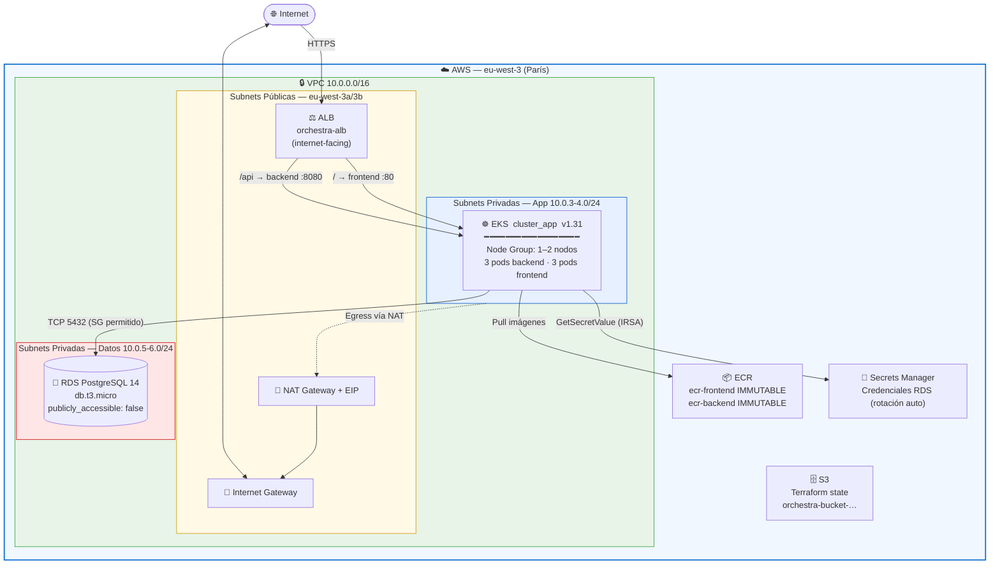

| Capa | Tecnología |
|------|------------|
| Infraestructura como código | Terraform ≥ 1.0 · provider AWS `~> 5.0` |
| Orquestación de contenedores | Amazon EKS v1.31 |
| Registro de imágenes | Amazon ECR — 2 repositorios (frontend + backend) |
| Base de datos | Amazon RDS PostgreSQL 14 (`db.t3.micro`) |
| Networking | VPC · IGW · NAT GW · Route Tables · Security Groups |
| Identidad | IAM Roles · OIDC (IRSA + GitHub Actions) |
| Ingress | AWS Load Balancer Controller (ALB) |
| Gestión de secretos | AWS Secrets Manager + Secrets Store CSI Driver |
| CI/CD | GitHub Actions (GitOps) |

---

## ✅ Requisitos previos

- [Terraform](https://developer.hashicorp.com/terraform/install) ≥ 1.0
- [AWS CLI](https://docs.aws.amazon.com/cli/latest/userguide/install-cliv2.html) v2 con credenciales de administrador
- [kubectl](https://kubernetes.io/docs/tasks/tools/) y [Kustomize](https://kustomize.io/)
- [Helm](https://helm.sh/) (para instalar ALB Controller y CSI Driver)
- Bucket S3 `orchestra-bucket-622370466117-eu-west-3-an` creado previamente (backend de Terraform)
- Permisos IAM suficientes para crear VPC, EKS, ECR, RDS e IAM roles

---

## 📁 Estructura del repositorio

```
orchestra-deployment/
├── .github/
│   └── workflows/
│       └── deploy.yaml              # Pipeline GitOps → EKS
├── despliegue/
│   ├── k8s/                         # Manifiestos de Kubernetes
│   │   ├── namespace.yaml           # orchestra-namespace
│   │   ├── backend-deployment.yaml  # 3 réplicas, puerto 8080
│   │   ├── backend-service.yaml
│   │   ├── frontend-deployment.yaml # 3 réplicas, puerto 80 (Nginx)
│   │   ├── frontend-service.yaml
│   │   ├── ingress.yaml             # ALB internet-facing
│   │   ├── rbac.yaml                # Role + RoleBinding CSI Driver
│   │   ├── serviceAccount.yaml      # IRSA backend + frontend
│   │   └── kustomization.yaml       # Gestión dinámica de image tags
│   └── terraform/
│       ├── main.tf                  # Composición de módulos
│       ├── backend.tf               # Estado remoto en S3
│       ├── providers.tf             # AWS provider eu-west-3
│       └── modules/
│           ├── network/             # VPC · Subnets · IGW · NAT · SGs
│           ├── eks/                 # Clúster · Node Group · OIDC
│           ├── ecr/                 # Repositorios de imágenes Docker
│           ├── iam/                 # Roles · Políticas · OIDC providers
│           └── storage/             # RDS PostgreSQL + Subnet Group
└── .gitignore                       # Excluye secretos, tfstate, .env…
```

---

## 🔧 Infraestructura — Terraform

El estado se almacena de forma remota en S3:

```hcl
# despliegue/terraform/backend.tf
bucket = "orchestra-bucket-622370466117-eu-west-3-an"
key    = "proyect/proyect.tfstate"
region = "eu-west-3"
```

### Dependencias entre módulos

`main.tf` actúa como raíz que orquesta los cinco módulos pasando outputs entre ellos:

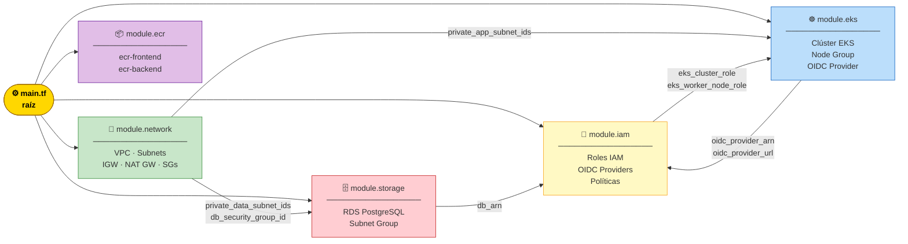

---

### Módulo: network

**Ruta:** `despliegue/terraform/modules/network/`

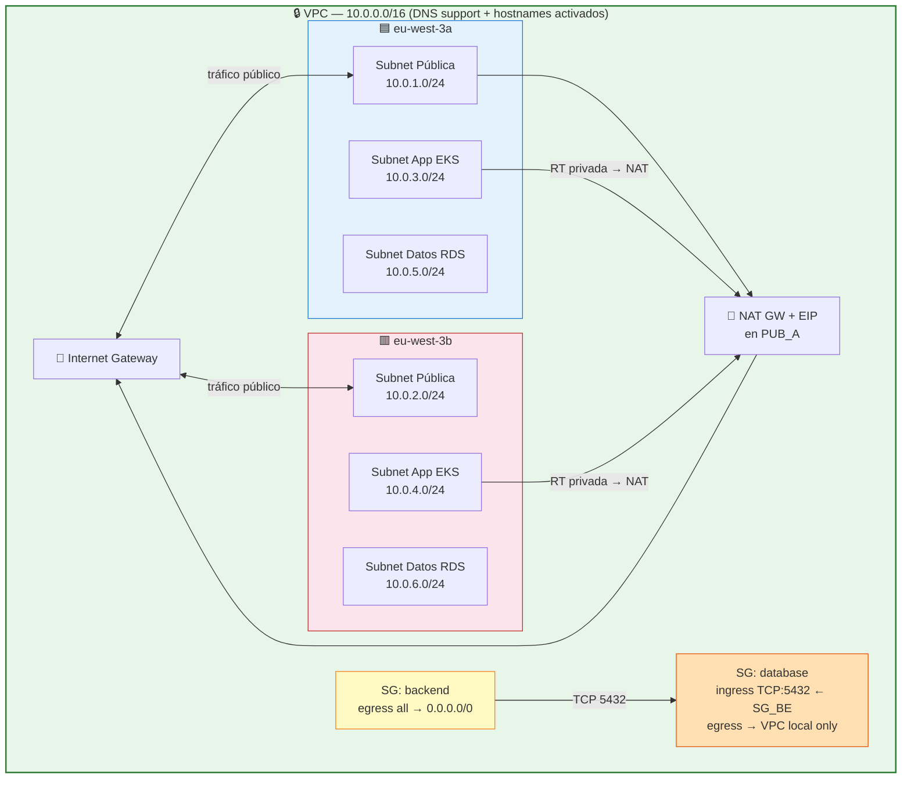

| Recurso | CIDR / Valor |
|---------|-------------|
| VPC | `10.0.0.0/16` |
| Subnets públicas | `10.0.1.0/24`, `10.0.2.0/24` |
| Subnets app (EKS) | `10.0.3.0/24`, `10.0.4.0/24` |
| Subnets datos (RDS) | `10.0.5.0/24`, `10.0.6.0/24` |
| AZs | `eu-west-3a`, `eu-west-3b` |
| SG Backend | Egress total hacia `0.0.0.0/0` |
| SG Database | Ingress solo TCP:5432 desde SG Backend |

---

### Módulo: eks

**Ruta:** `despliegue/terraform/modules/eks/`

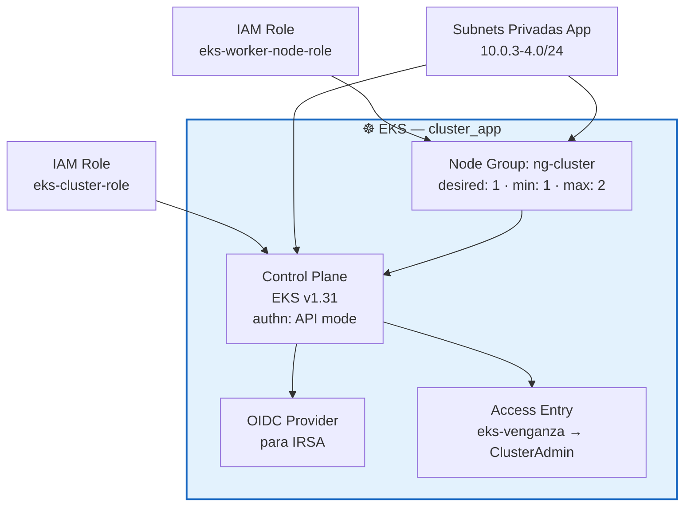

| Parámetro | Valor |
|-----------|-------|
| Nombre | `cluster_app` |
| Versión | `1.31` |
| Autenticación | Modo `API` |
| Node Group | `ng-cluster` — desired 1, min 1, max 2 |
| Subnets | Privadas de app (multi-AZ) |
| Admin IAM | `eks-venganza` con `AmazonEKSClusterAdminPolicy` |

---

### Módulo: ecr

**Ruta:** `despliegue/terraform/modules/ecr/`

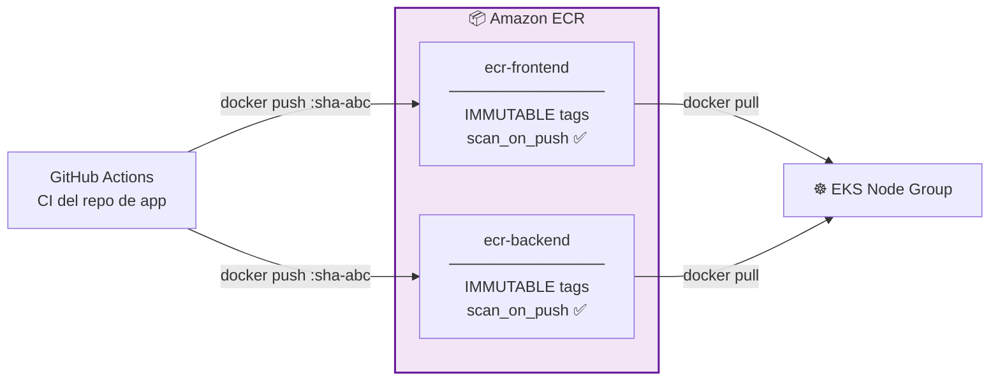

> **Tags inmutables:** una vez publicada una imagen con un tag concreto no puede sobreescribirse, garantizando trazabilidad completa y rollbacks seguros.

---

### Módulo: iam

**Ruta:** `despliegue/terraform/modules/iam/`

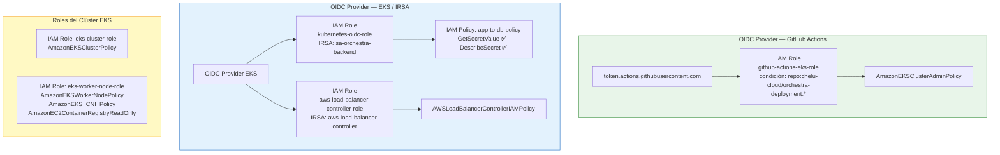

---

### Módulo: storage

**Ruta:** `despliegue/terraform/modules/storage/`

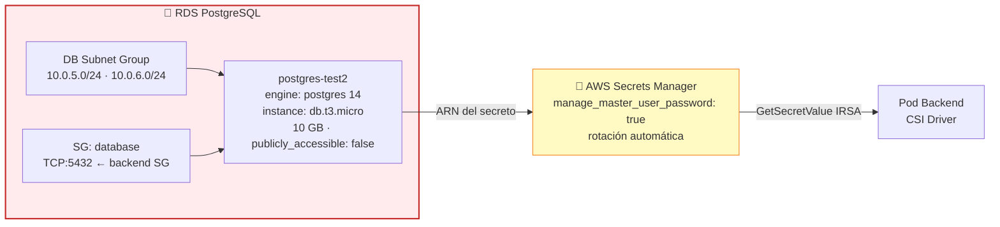

| Parámetro | Valor |
|-----------|-------|
| Identificador | `postgres-test2` |
| Motor | PostgreSQL 14 |
| Instancia | `db.t3.micro` |
| Almacenamiento | 10 GB |
| Acceso público | `false` |
| Contraseña | Gestionada por AWS Secrets Manager (rotación automática) |

---

## ☸️ Kubernetes

Todos los manifiestos pertenecen al namespace `orchestra-namespace`.

### Vista general del clúster

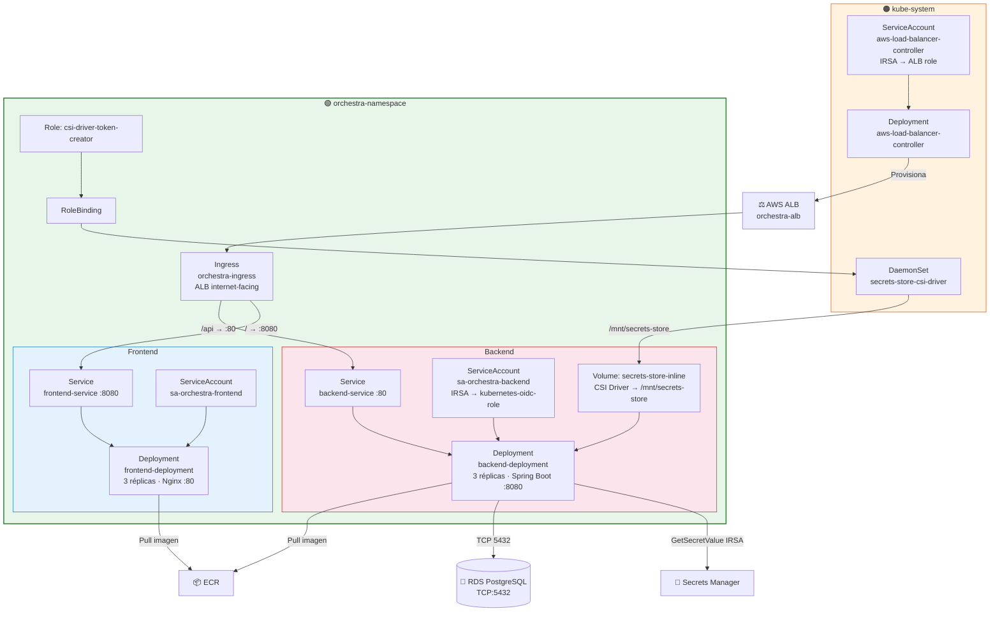

---

### Despliegues y recursos

| Parámetro | Backend | Frontend |
|-----------|---------|----------|
| Réplicas | 3 | 3 |
| Imagen base | `ecr-backend` | `ecr-frontend` (Nginx) |
| Puerto contenedor | `8080` | `80` |
| CPU request / limit | `250m` / `1` | `250m` / `1` |
| Memory request / limit | `512Mi` / `1Gi` | `512Mi` / `1Gi` |
| Service Account | `sa-orchestra-backend` | `sa-orchestra-frontend` |
| Secretos DB | CSI Driver → `/mnt/secrets-store` | — |

---

### Enrutamiento con ALB

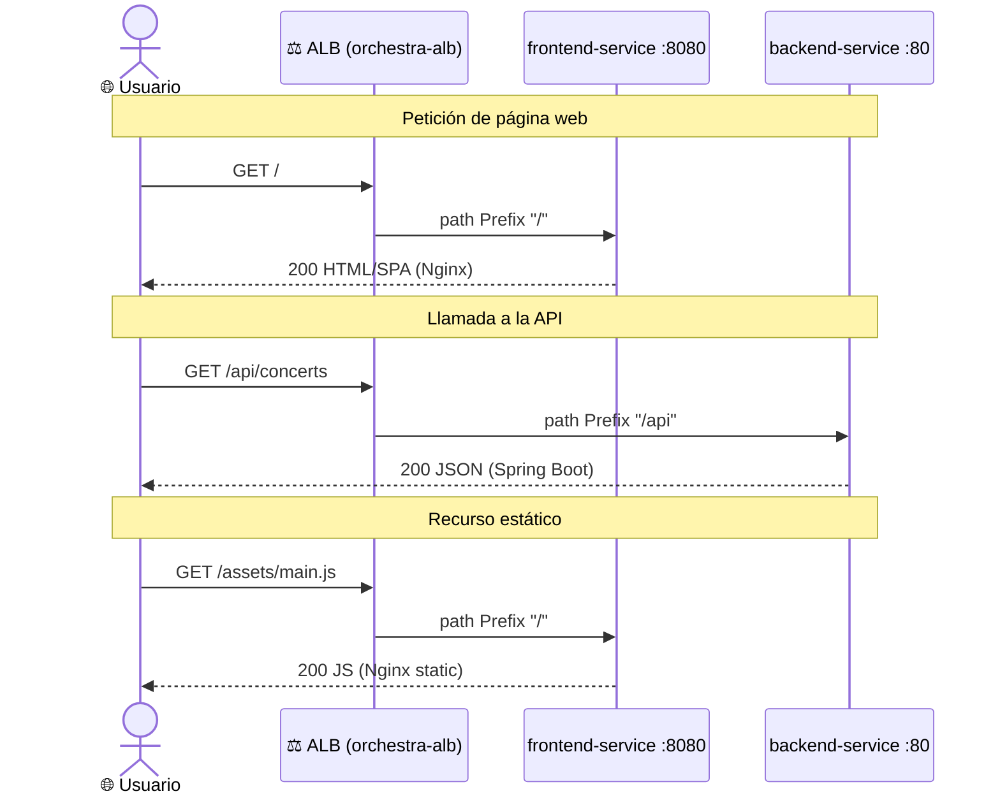

---

### RBAC y Service Accounts

El backend usa **IRSA (IAM Roles for Service Accounts)** para acceder a Secrets Manager sin credenciales estáticas:

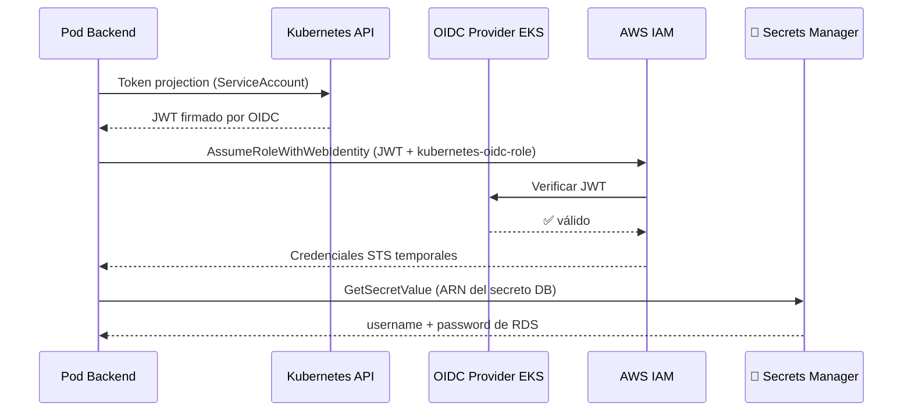

**RBAC para el CSI Driver:**

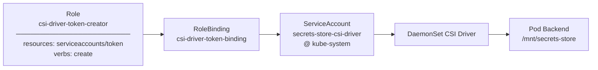

---

## 🔄 CI/CD — GitHub Actions

**Workflow:** `.github/workflows/deploy.yaml`

| Trigger | Condición |
|---------|-----------|
| `push` a `main` | Solo si hay cambios en `k8s/**` |
| `workflow_dispatch` | Ejecución manual desde GitHub UI |
| `repository_dispatch` | Evento `deploy-trigger` enviado desde el repo de la app |

### Flujo GitOps completo

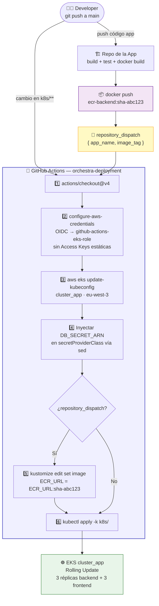

---

### Autenticación OIDC

El proyecto usa OIDC en **dos capas independientes** para eliminar completamente el uso de credenciales AWS de larga duración:


---

## 🔑 Secretos requeridos

Configura en **GitHub → Settings → Secrets and variables → Actions:**

| Secreto | Descripción | Cómo obtenerlo |
|---------|-------------|----------------|
| `AWS_DB_SECRET_ARN` | ARN del secreto de RDS en Secrets Manager | Output `db_secret_arn_final` de `terraform apply` |

> ℹ️ **No se necesitan** `AWS_ACCESS_KEY_ID` ni `AWS_SECRET_ACCESS_KEY`. La autenticación a AWS se gestiona mediante OIDC.

---

## 🚀 Despliegue paso a paso

### 1 — Aprovisionar infraestructura con Terraform

```bash
cd despliegue/terraform

# Inicializar — descarga providers y configura backend S3
terraform init

# Revisar el plan antes de aplicar
terraform plan

# Aprovisionar
terraform apply
```

> Anota el output `db_secret_arn_final` y configúralo como secreto `AWS_DB_SECRET_ARN` en GitHub.

### 2 — Conectar kubectl al clúster

```bash
aws eks update-kubeconfig --name cluster_app --region eu-west-3
kubectl get nodes   # verificar nodos en estado Ready
```

### 3 — Instalar componentes del clúster (Helm)

```bash
# AWS Load Balancer Controller
helm repo add eks https://aws.github.io/eks-charts
helm repo update
helm install aws-load-balancer-controller eks/aws-load-balancer-controller \
  -n kube-system \
  --set clusterName=cluster_app \
  --set serviceAccount.create=false \
  --set serviceAccount.name=aws-load-balancer-controller

# Secrets Store CSI Driver
helm repo add secrets-store-csi-driver \
  https://kubernetes-sigs.github.io/secrets-store-csi-driver/charts
helm install csi-secrets-store \
  secrets-store-csi-driver/secrets-store-csi-driver \
  -n kube-system \
  --set syncSecret.enabled=true
```

### 4 — Desplegar manifiestos de Kubernetes

El despliegue se ejecuta **automáticamente vía GitHub Actions**. Para un despliegue manual:

```bash
cd despliegue/k8s
kubectl apply -k .
```

### 5 — Verificar el despliegue

```bash
# Ver pods en ejecución
kubectl get pods -n orchestra-namespace

# Ver servicios e ingress
kubectl get svc,ingress -n orchestra-namespace

# Obtener URL pública del ALB
kubectl get ingress orchestra-ingress -n orchestra-namespace \
  -o jsonpath='{.status.loadBalancer.ingress[0].hostname}'

# Ver logs del backend
kubectl logs -l app=backend-deployment -n orchestra-namespace --tail=50
```

---

## 🛡 Seguridad

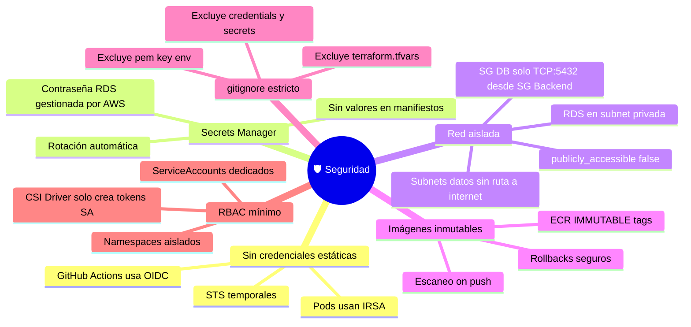

| Medida | Detalle |
|--------|---------|
| 🔑 Sin credenciales estáticas | GitHub Actions y pods EKS se autentican via OIDC/IRSA |
| 🔐 Secrets Manager | Credenciales de RDS rotadas por AWS; nunca en texto plano |
| 🌐 Red aislada | RDS en subnets privadas; SG de BD solo acepta TCP:5432 desde SG backend |
| 📦 Imágenes inmutables | ECR con `IMMUTABLE` tags y escaneo automático de vulnerabilidades |
| 🚫 `.gitignore` estricto | Excluidos: `*.pem`, `*.key`, `*credentials*`, `terraform.tfvars`, `.env` |
| 🔒 RBAC mínimo | El CSI Driver solo tiene permiso de crear tokens de ServiceAccount |

---

<div align="center">

**Orchestra Deployment** · Infraestructura gestionada con Terraform · Despliegues con GitOps

Developed with ❤️ by chelucloud / cheludev (my other github) · [LinkedIn](https://www.linkedin.com/in/jose-luis-salvador-martin-b88ba3292/)

</div>